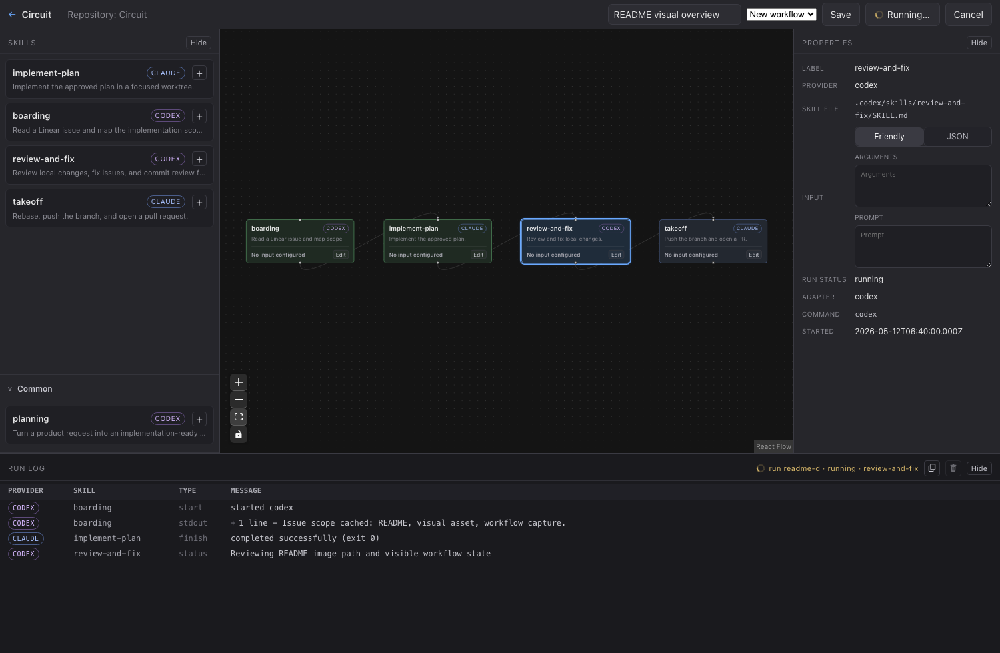

<p align="center">
  
</p>

# Circuit

[한국어 README](README_kr.md)

Circuit is a local-first desktop app for turning Claude and Codex skills into visual workflows.

Circuit grew out of a problem that shows up quickly in personal projects: agent automation is powerful, but it becomes hard to steer once it is running outside your direct attention. Long command chains and TUI sessions can hide what the agent is doing, what already finished, and where the next decision point should be.

Circuit gives those routines a visible control surface. Instead of keeping automation steps in disconnected command lists, you can register local repositories, scan the skills they already contain, place those skills on a workflow canvas, and run the flow while watching the log. It is built for developers who use both Claude and Codex and want a shared visual layer over those local skill systems.

The canvas is intentionally block-like: put review before commit, commit before review, add a token check between two expensive steps, or insert a new routine block when the workflow changes. If the dependency between skills changes, reconnect the nodes instead of rewriting the whole process from memory.

## Visual Workflow Overview



The Circuit workspace brings mixed Claude and Codex skills into one visual workflow, with execution progress visible in the Run Log while the canvas remains editable.

## What Circuit Does

- Registers local repositories so each project can have its own skill catalog and saved workflows.
- Scans repository-local skills from both Claude and Codex conventions:
  - `.claude/skills/*/SKILL.md`
  - `.codex/skills/*/SKILL.md`
- Shows Claude and Codex skills together so a workflow can mix providers in one canvas.
- Includes supported system and default skills that can be placed into workflows across repositories.
- Provides a visual workflow canvas for arranging skill nodes and dependency edges.
- Saves and loads workflow drafts for a repository.
- Runs workflows manually and streams run output into an in-app run log.
- Supports cancelling an active run.
- Allows cyclic workflow graphs after an explicit loop warning, so intentional loops remain visible.
- Uses provider adapters for Claude and Codex instead of hard-coding a single agent runtime.

## Why Claude And Codex Together

Many repositories already carry useful automation in more than one agent format. Circuit treats Claude and Codex skills as local project capabilities rather than competing silos. A workflow can show where each provider fits, make the handoff visible, and keep the repository as the source of truth for the actual skill files.

That means a team can keep using existing `.claude/skills` and `.codex/skills` directories while building a visual map of how those skills work together.

## Visual Workflow Canvas

The workspace centers on a canvas where skill nodes represent local `SKILL.md` files. The surrounding panels make the current repository, skill list, workflow name, saved workflow menu, start/cancel controls, and run log visible while you work.

Circuit is not trying to become a code editor. It focuses on the workflow layer: discovering skills, arranging them, saving the graph, and running the selected flow locally.

This makes routine design closer to visual programming than a hidden shell history. If a workflow needs a new gate, add a skill node. If you want to monitor usage, place a `check-token` style skill between larger steps. If a failure happens, the canvas and run log keep the current stage visible instead of forcing you to reconstruct the run from scattered terminal output.

Loops are also first-class in the editor. Circuit warns before starting a workflow that contains a cycle because it may run indefinitely, but it does not erase the loop from the graph. That keeps repeating routines explicit and reviewable.

## Local-First Runtime Model

Circuit runs against files and tools on your machine:

- Skill discovery reads from the selected repository.
- System and default skills are available as reusable workflow nodes.
- Workflow execution goes through a Tauri backend bridge.
- Claude and Codex execution are handled through adapter interfaces.
- Run output is streamed back to the app log.
- Safety-sensitive runtime behavior stays local rather than being delegated to a remote service.

The current model is intentionally manual. Circuit does not automatically trigger file mutations, push to git remotes, deploy code, or run arbitrary shell-command nodes.

## Current Status

Circuit is in active development. The current app includes the foundation for:

- repository registration and removal
- skill scanning for Claude and Codex skill directories
- bundled system and default skill discovery
- provider count badges in the repository list
- workflow canvas editing
- loop detection with an explicit run confirmation
- workflow draft save/load
- manual workflow start
- run status and run log display
- run cancellation
- Claude and Codex adapter implementations

Known limitations at this stage:

- No collaboration or shared remote workspace.
- No automatic deployment or git push behavior.
- No user-configurable global skill directory discovery yet.
- No arbitrary shell command node type.
- The runtime surface is still being hardened as the app evolves.

## Development

The app lives in `app/` and uses React, Vite, Tauri, Vitest, and Playwright.

```sh
cd app
pnpm install
pnpm dev
```

Useful checks:

```sh
pnpm test:run
pnpm build
pnpm test:e2e
```

## Project Notes

Detailed implementation notes, runtime contracts, schema documentation, and phase briefings live outside the root README so this page can stay focused on the product:

- `PRODUCT_SPEC.md`
- `RUNTIME_ARCHITECTURE.md`
- `SCHEMA.md`
- `SKILL_EXECUTION_CONTRACT.md`
- `TESTING_STRATEGY.md`
- `circuit_implementation_plan/`
