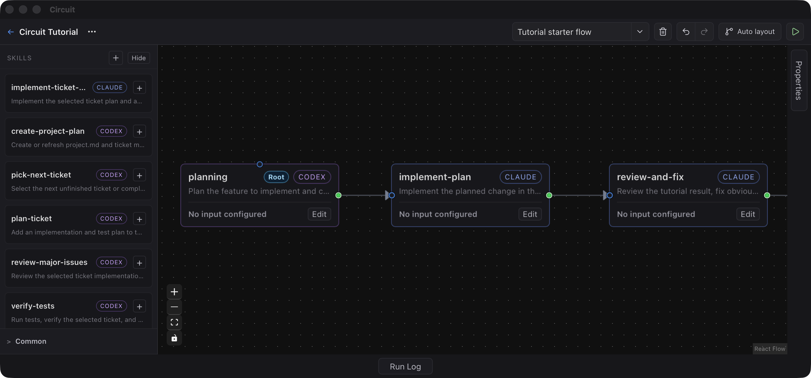

# Circuit - Skill-Based AI Agent Harness Editor

<p align="center">
  
</p>

<p align="center">
  <a href="https://github.com/CIrcui-try/Circuit/actions/workflows/ci.yml?branch=develop"></a>
  <a href="https://github.com/CIrcui-try/Circuit/releases"></a>
  <a href="LICENSE"></a>
  
  
  
</p>

[한국어 README](README_kr.md) | [中文 README](README_zh.md)

<p align="center">
  
</p>

Circuit is a skill-based AI Agent harness editor for turning agent work into visible, repeatable, and controllable development workflows.

Circuit started from a recurring pain point in AI-native projects. As more work gets delegated to agents, such as planning, implementation, and review, productivity improves, but the actual development flow gets hidden inside long prompts, command chains, and verbose output that can be hard to understand. As projects grow, this problem becomes more visible, and it becomes common to spend a long time digging through terminal output just to find which task finished, which one is running, and where a problem occurred.

Modular Skills helped manage this flow. As agent work becomes a repeating routine, skills move beyond one-off prompts or helper scripts and begin to function as repeatable units of development. But Skill-Driven Development still often depends on text-based flows, which makes workflows hard to edit and understand. Relationships and dependencies between skills are not visible at a glance, so even changing order or adding a branch requires tracing the whole flow again.

Circuit was built to turn this Skill-Driven Development into a visible, repeatable, and above all human-understandable _visual workflow_.

## TL;DR
### Quickstart

The easiest way to get started is to download the latest macOS app from GitHub Releases.

You can also clone this repository and run Circuit from source.

```bash
git clone https://github.com/CIrcui-try/Circuit
cd Circuit/app
pnpm install
pnpm tauri dev
```

If you need a local build, run:

```bash
cd app
pnpm tauri build
```

After launching Circuit, choose the repository you want to work with, then place skills from `.claude/skills` or `.codex/skills` onto the canvas to build a workflow.

## What Can You Do With Circuit?

### Build Visual Skill Workflows

https://github.com/user-attachments/assets/b04314bb-49fd-40ec-a89e-c64aea4e17ef

Circuit is centered on connecting skills into a workflow. You can bring in the skills you need as blocks, reorder them, connect their dependencies, and insert new steps into the flow.

For example, you can create a flow like this:

```text
planning → implementation → review → commit
```

When the routine changes, the workflow can change with it:

```text
planning → implementation → commit → review
```

If you need an intermediate check, add a new skill into the flow:

```text
planning → check-token → implementation → review → wrap-up
```

When the context gets long, you can add a `compact` skill. If you want to check token usage along the way, you can create a skill such as `check-token` and place it between larger steps.

With Circuit, when skill order or dependencies change, you do not need to reconstruct the procedure between skills from memory. You can update the nodes and edges instead.

### Track Execution State

https://github.com/user-attachments/assets/08b5fb7f-6da0-4a0b-a7a6-59307791680f

When a workflow runs, you can see which skill is currently running, which steps have completed, and where a failure happened through the canvas and Run Log.

Active workflows can be cancelled when needed, and failed runs are easier to inspect because the stopping point remains visible.

### Handle Loops

https://github.com/user-attachments/assets/4436fe4f-ec41-4ebb-a8a5-5e99944e1604

Not every workflow ends in a straight line. Some routines need repetition. For example, you may want to review a failed task again or repeat a check until a condition is satisfied.

Circuit helps you manage these repeated flows more safely. Since a cyclic graph can run indefinitely, Circuit shows a warning before execution and lets you run it only after confirming that the loop is intentional.

Because the loop remains visible on the canvas, you can see which skill will be called again and adjust the routine when needed.

### Use Claude And Codex Together

https://github.com/user-attachments/assets/f37c94f1-7af4-4984-8cec-41bac0d59ffd

Many projects already contain more than one kind of agent automation. Some routines may be written as Claude skills, while others may be managed as Codex skills. Within the same agent, you may also want to choose different models depending on the task.

Circuit reads `.claude/skills/*/SKILL.md` and `.codex/skills/*/SKILL.md` from your local repository and lets you place both kinds of skills on the same canvas. It does not treat Claude and Codex as competing tools. It treats them as different execution capabilities and model choices that belong to the local project.

The actual skill files remain in the repository. Circuit does not move them elsewhere or force them into a separate format. Instead, it reads the skills from the repository, shows them on the canvas, and provides a visual layer for defining their order and dependencies.

## Contributions Welcome

Circuit is still under active development. Bug reports, usability feedback, documentation improvements, example workflows, runtime stability work, and UI improvements are all welcome.

Small contributions are welcome too. If something was confusing while you tried the app, open an issue. If the README can be clearer, improve it. If you have a `.claude/skills` or `.codex/skills` workflow you use often, sharing that example can help a lot.

To develop locally:

```bash
git clone https://github.com/CIrcui-try/Circuit
cd Circuit/app
pnpm install
pnpm tauri dev
```

Before opening a PR, please run the checks you reasonably can:

```bash
cd app
pnpm test:run
pnpm build
cd src-tauri
cargo test
```

For larger features or changes to runtime behavior, please open an issue first and share the intent. Circuit deals with local repositories and agent execution flows, so it is important to consider not only convenience but also whether users can understand and control what is happening.

Please write commit messages, PR titles, and PR descriptions in English.
